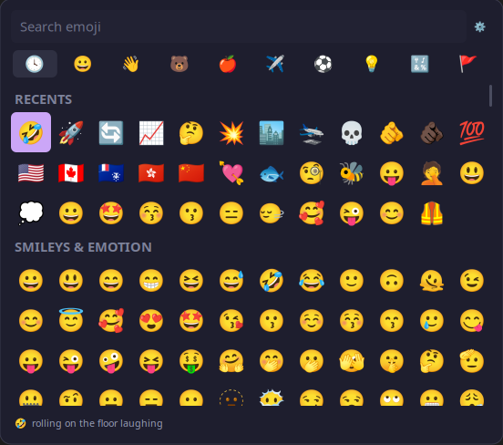
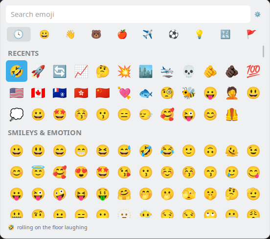

# pika

A 100% Wayland native grid emoji picker for KDE, in the style of the Windows and macOS pickers.
Press a hotkey, pick an emoji, and it appears in whatever you were typing in.


<p>
  
  
</p>


## Features

- **Everything in one list.** Recents pinned at the top, then every category behind its
  own header
- **Fuzzy Search** by name and keyword
- **Skin tone** applied across the grid, configured in settings.
- **Inserts directly** into the focused text field with clipboard fallback
- **Daemonless**, no background process to listen to keypresses, blazingly fast cold start 🚀
- **Small.** Zero dependency on GTK or QT, 100% native Wayland client drawing with cairo. ~37 MB
  RAM usage when active, 5MB portable binary with no external dependencies (Except of course, Wayland and KDE)
- **No helper binaries or elevated access** Other KDE emoji pickers depend on helper binaries like ydotool, wl-copy, wtype, rofi, etc. A process that can read every keystroke you type and costs extra memory as a background process

## How it compares

Plenty of emoji pickers exist. What separates them on KDE Wayland is how they get the
character into your text field — and most either can't, or need privileges to do it.

| Picker                                                            | Insert mechanism                             | Setup or dependencies            | Works on KDE Wayland           | Search              | Skin tone        | Beyond plain emoji      | Daemonless          |
| ----------------------------------------------------------------- | -------------------------------------------- | -------------------------------- | ------------------------------ | ------------------- | ---------------- | ----------------------- | ------------------- |
| **pika**                                                          | zwp_input_method_v1, portal paste fallback   | none                             | yes                            | fuzzy, ranked       | global           | no                      | yes                 |
| plasma-emojier (KDE built in)                                     | clipboard only                               | none                             | clipboard                      | substring           | global           | no                      | yes                 |
| [rofimoji](https://github.com/fdw/rofimoji)                       | `wtype`                                      | a supported menu (rofi/wofi)     | no                             | via your menu       | global or prompt | Nerd Fonts, kaomoji     | yes                 |
| [bemoji](https://github.com/marty-oehme/bemoji)                   | `wtype`                                      | a supported menu                 | no                             | via your menu       | filter only      | any list you feed it    | yes                 |
| [jockel09/emoji-picker](https://github.com/jockel09/emoji-picker) | clipboard + `ydotool`/`dotool` Ctrl+V        | `input` group, raw `/dev/uinput` | yes                            | substring, DE/EN    | global + gender  | favourites, kaomoji tab | no                  |
| [emojipick](https://github.com/guitaripod/emojipick)              | clipboard + optional `ydotool` Ctrl+V        | ydotoold, `input` group          | yes                            | fuzzy, tiered       | global           | no                      | no                  |
| [im-emoji-picker](https://github.com/GaZaTu/im-emoji-picker)      | input method plugin                          | fcitx5 or ibus, configured       | yes                            | substring           | global + gender  | kaomoji view            | no                  |
| [Smile](https://github.com/mijorus/smile)                         | clipboard, GNOME-oriented                    | none                             | clipboard                      | fuzzy, many locales | per emoji        | your own tags           | yes                 |
| Emote                                                             | clipboard, X11 auto-paste only               | none                             | clipboard                      | substring           | no               | no                      | no                  |

The `wtype` pickers will not work on KDE because KWin does not implement the protocol they type through

### Other Wayland desktops

Only KDE is officially supported. In an effort stay lightweight and portable, it will likely
stay this way, but feel free to send a pull request if you would like to implement it.

## Install

```sh
./contrib/install.sh
```

This builds the binary, puts it in `~/.local/bin`, and installs a hidden `.desktop`
entry. Requires a Rust toolchain, and cairo and pango at runtime — both of which a KDE
desktop already has.

### Bind a hotkey

System Settings → **Keyboard → Shortcuts → Add New → Command or Script**, enter the full
path `~/.local/bin/pika`, click the shortcut field and press your key. `Meta+.`
and `Meta+;` are both good choices.

> Add the shortcut through System Settings rather than by editing config files. KDE
> caches the command when your session starts, so a hand-edited `.desktop` file keeps
> launching whatever was there before until you log out.

## Usage

| Key                   | Action                             |
| --------------------- | ---------------------------------- |
| type                  | search by name and keyword         |
| ← ↑ ↓ →               | move around the grid               |
| Page Up / Page Down   | scroll a screenful                 |
| Enter                 | insert the selected emoji          |
| Tab / Shift-Tab       | next / previous category           |
| Ctrl-,                | open settings                      |
| Esc, or click outside | cancel                             |
| click                 | insert; a category tab jumps to it |

In the search box:

| Key                    | Action                            |
| ---------------------- | --------------------------------- |
| Ctrl-← / Ctrl-→        | move the cursor a word            |
| Home / End             | start / end of the line           |
| Backspace / Delete     | delete either side of the cursor  |
| Ctrl-Backspace, Ctrl-W | delete the word before the cursor |
| Ctrl-Delete            | delete the word after it          |
| Ctrl-U                 | clear                             |
| Ctrl-V                 | paste                             |
| click                  | put the cursor where you clicked  |

Plain ← and → stay with the grid, so the text cursor moves by word rather than by
character.

Pressing the hotkey again while the picker is open closes it.

### Options

| Flag                        | Effect                                                            |
| --------------------------- | ----------------------------------------------------------------- |
| `--no-insert`               | copy to the clipboard only; insert into nothing                   |
| `--copy`                    | also put the emoji on the clipboard when it was inserted directly |
| `--print`                   | write the chosen emoji to stdout as well                          |
| `--test-im`, `--test-paste` | check one insert route on its own, for debugging                  |
| `--bench`, `--time-launch`  | time the search table, or time to first frame                     |

## Troubleshooting

**Nothing happens when I press the hotkey.** Run `~/.local/bin/pika` in a
terminal. If it works there, the shortcut is still bound to an old command; re-add it in
System Settings. If it prints `compositor has no wlr-layer-shell`, you are on a desktop
this cannot draw on — see [Other Wayland desktops](#other-wayland-desktops).

**The emoji lands on the clipboard but not in the field.** Some apps (generally older
X11 ones) can't take a direct insert, so the picker asks KDE for permission to paste on
your behalf. Approve the "Remote Desktop" dialog the first time and it will not ask
again. If you declined it, revoke and retry under System Settings → Applications →
Remote Desktop.

**KDE keeps telling me a remote control session started.** That notification comes from
the fallback paste route. [AGENTS.md](AGENTS.md) explains how to mute it, and why you
might not want to.

**Emoji show as blank boxes.** Install a colour emoji font, e.g. `noto-fonts-emoji`.

### Why it asks for "Remote Desktop" permission

The direct path is a Wayland input method, and it only reaches apps that support
`zwp_text_input`. X11, XWayland, and certain Chromium and Electron apps do not.

For those the picker has to press Ctrl+V for you, and KWin does not implement the
protocol for faking keystrokes, any client could otherwise type into any window
unprompted. The RemoteDesktop portal is used as an alternative. It will request
permissions at first startup.

## Configuration

The gear beside the search box — or `Ctrl-,` — opens the settings: whether to insert or
only copy, whether to always copy as well, the skin tone, how many recents to keep, and a
reset for the saved paste permission. Arrows move and change, Enter activates, Escape goes
back.

Everything lives in `~/.config/pika/state.json`. Delete it to start over.

## Contributing

See [AGENTS.md](AGENTS.md) for the architecture, how emoji data is regenerated from
Unicode, and the Wayland and KDE specifics that shaped the implementation.

## Licence

MIT — see [LICENSE](LICENSE).

Open source under MIT License

Emoji names and keywords are Unicode data, under their own terms; see `data/LICENSE`.
